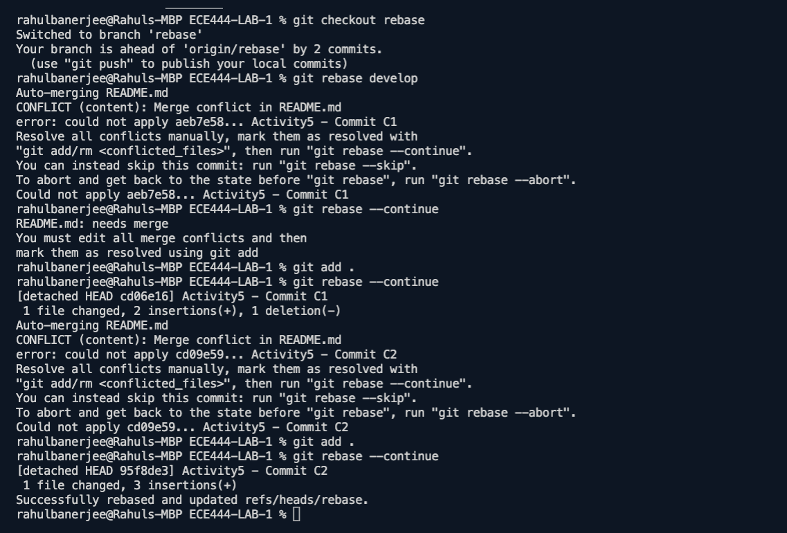

Rahul Banerjee

### Rebase Screenshot

- Go to branch 'rebase' and type
    ```bash
    git rebase develop
    ```
- resolve merge conflicts
    ```bash
    git rebase --continue
    ```
- Resolve all merge conflicts till rebase is successful




